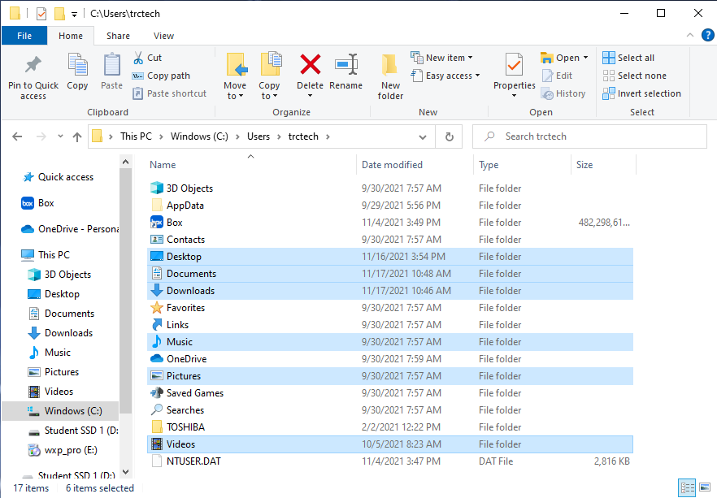
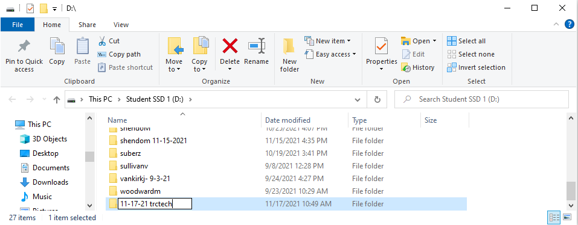
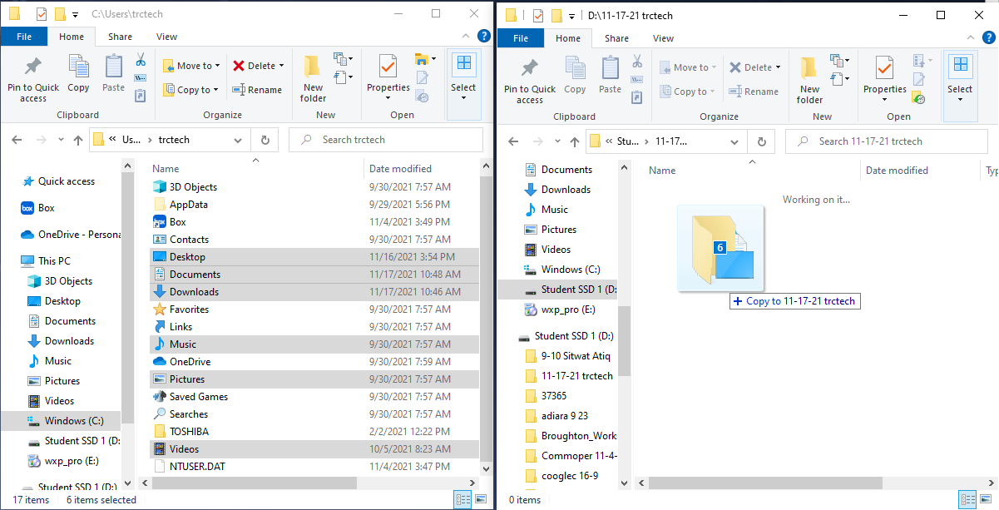

# User Data Backup

## Procedure

## Basic Backup
1. Navigate to *C:\Users* folder in Windows File Explorer & Open User's folder
    * Access it via File Explorer Icon
    * Access it via Keyboard Shortcut (Win + E)
<br><br/>
    
<br><br/>

2. Select the following Folders for transfer to External Drive
    * Desktop
    * Documents
    * Downloads
    * Music
    * Pictures
    * Videos
<br><br/>
    
<br><br/>

3. Create Folder on Backup SSD for format &
    * Format: MM-DD-YY client_username
    * Example: 11-17-21 cortesj
    * Example: 01-23-20 trctech
<br><br/>
    
<br><br/>

4. Drag & Drop selected folders to User's backup folder
<br><br/>

<br><br/>

## Robocopy Backup
1. Press: Win + X
2. Select: Powershell (Admin)
3. Type:
    ```
    robocopy <Source> <Destination> /S /E /MT:10 /R:0 /W:0 /XD <List-of-Excluded-Dirs>
    ```
    * ```<Source>``` | File Path you wish to copy
    * ```<Destination>``` | Where you wish to copy to
    * ```<List-of-Excluded-Dirs>``` | List the Directories to not copy
4. Press: Enter
    * Use example below to copy a User's Data to SSD
    * Ensure you are an Admin on Computer
    * Restart Command if program fails mid-way

**Example**

```
robocopy C:\Users\cortesj "D:\SSD5\10-10-10 cortesj" /S /E /MT:10 /R:0 /W:0 /XD ("AppData", "Application Data", "Box", "3D Objects", "Contacts", "Favorites", "OneDrive", "Saved Games", "Searches", "Toshiba")
```
<br><br/>
## Linux Backup