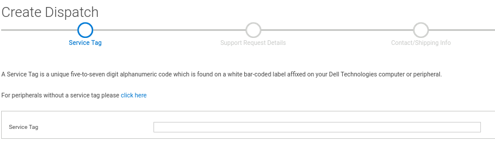
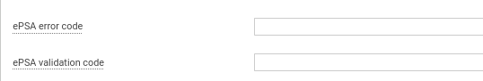
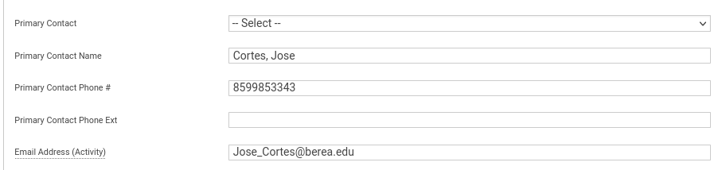
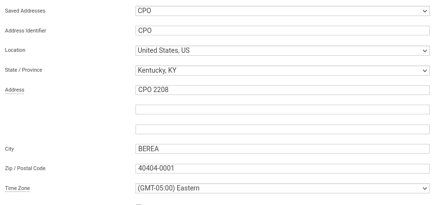
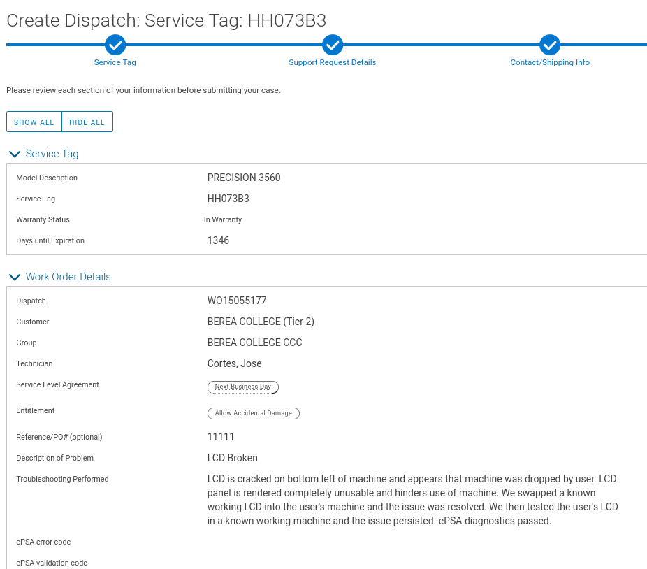

#How to order from Dell Tech

1.	Click Self-Dispatch
2.	Create Dispatch
3.	Get the Service Tag from Bios
4.	Add the Reference/PO# as the ticket number
5.	Are you replacing any parts as a result of damage, spills, drops, or other similar events ? YES/NO
6.	Description of Problem and Troubleshooting Performed
7.	Primary Contact is [Your Name]
8.	Secondary contact is Nathaniel Clements or Jessie
9.	Use Default Address 
10.	Select parts (Check if we have run diags and if user accepted charges) 
11.	Copy SR number to ticket

